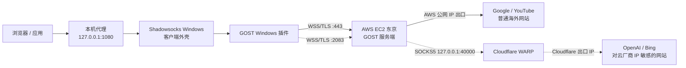
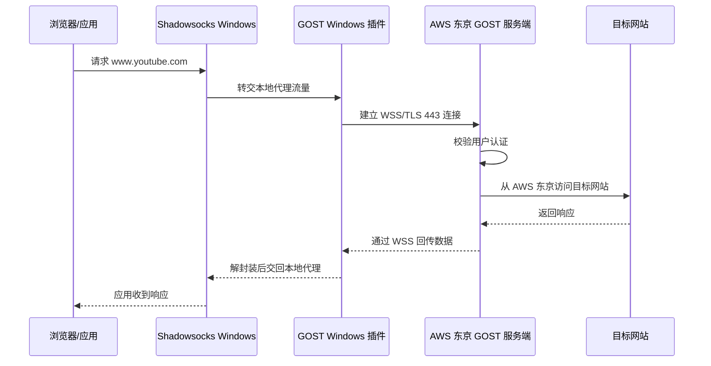
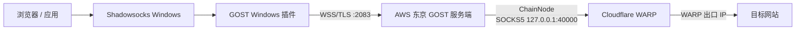
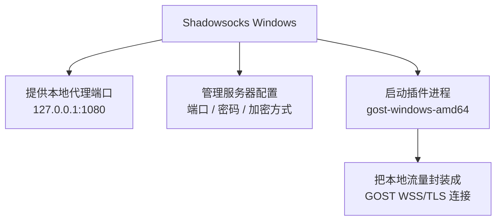
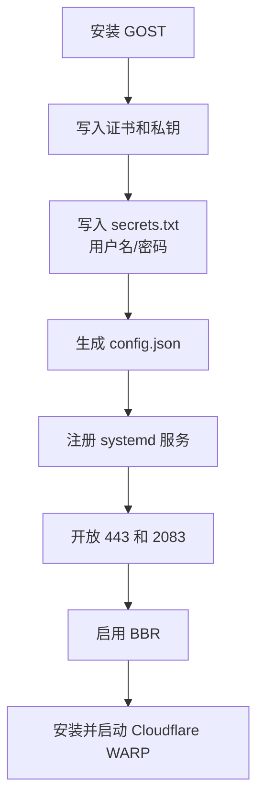
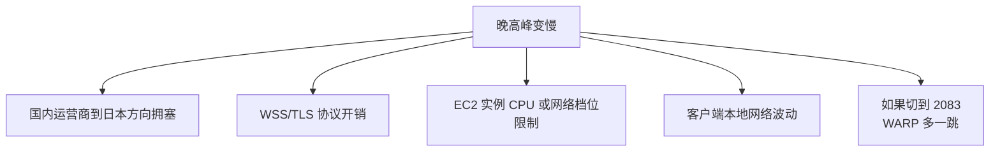
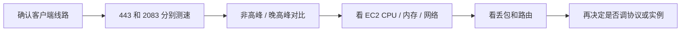

这篇文章复盘的是我自己在 AWS 东京区跑了两年多的一套自用代理链路。最开始我以为它还是 Shadowsocks 方案，重新看了一遍客户端配置和服务端脚本后才发现：Shadowsocks Windows 只是客户端入口，真正负责跨境传输的是 GOST。

当前主链路是 `GOST + WSS/TLS + 443`，备用链路是 `GOST + WSS/TLS + 2083 + Cloudflare WARP`。本文只记录技术细节，不展开成本优化；真实 IP、域名、用户名、密码和证书私钥也全部省略。

<!-- more -->

## 总体架构

先看全貌。主线路和备用线路共用同一个客户端入口，也共用同一台 AWS 东京实例，差别在于服务端收到流量后从哪里出网。



一句话概括：

```text
Shadowsocks Windows 管本地代理入口
GOST Windows 插件管客户端侧封装
GOST Linux 服务端管远端解封装和转发
AWS 东京负责主出口
Cloudflare WARP 负责备用出口
```

## 主线路：443 直出 AWS

我日常使用的是 `443` 线路。它没有经过 WARP，链路比较短。



这条链路里，目标网站看到的来源是 AWS 东京公网 IP。对 Google、YouTube、普通网页和下载来说，这通常是优先线路，因为路径更短，少一次中转。

## 备用线路：2083 经 WARP 出口

备用线路走 `2083`。这里不能省略 Windows 侧的 GOST 插件，因为客户端到 AWS 之间仍然是 GOST 插件发起的 WSS/TLS 连接，只是远端端口换成了 `2083`。



服务端脚本里对应的是两类配置：

```json
{
  "ServeNodes": [
    "wss://:443?secrets=/opt/gost/secrets.txt&cert=/opt/gost/ca.pem&key=/opt/gost/key.pem"
  ],
  "Routes": [{
    "ServeNodes": [
      "wss://:2083?secrets=/opt/gost/secrets.txt&cert=/opt/gost/ca.pem&key=/opt/gost/key.pem"
    ],
    "ChainNodes": [
      "socks5://127.0.0.1:40000"
    ]
  }]
}
```

`443` 是普通入口，收到请求后直接从 AWS 出口访问目标网站。`2083` 是带路由的入口，收到请求后先转给本机的 WARP SOCKS5 代理，再由 Cloudflare WARP 出口访问目标网站。

这条线路适合解决某些网站不接受 AWS IP 的问题，但不适合作为默认高速线路。它多了一跳 WARP，延迟、丢包和拥塞都会更明显。

## Windows 端到底做了什么

客户端看起来是在用 Shadowsocks Windows，但这个判断只对了一半。



所以 Shadowsocks Windows 的价值主要是：

1. 提供一个熟悉的本地代理入口。
2. 管理客户端配置。
3. 启动 GOST 插件。
4. 把应用流量交给插件。

真正跨境传输时，关键角色是 GOST 插件。也正因为如此，这套方案的稳定性不能简单归因于 Shadowsocks。

## 服务端到底做了什么

AWS 上的服务端脚本主要做了几件事。



服务端最核心的是 `config.json`。它定义了两个入口：

```text
443  -> GOST WSS 入口 -> AWS 直接出网
2083 -> GOST WSS 入口 -> WARP SOCKS5 -> Cloudflare 出网
```

此外，脚本还启用了 BBR：

```bash
net.core.default_qdisc=fq
net.ipv4.tcp_congestion_control=bbr
```

BBR 不能解决所有慢的问题，但对跨境 TCP 链路有帮助。它主要改善高延迟、轻微丢包场景下的吞吐表现。

## 为什么它比裸 Shadowsocks 稳定

早期方案里也有 Shadowsocks 服务端，但传统 Shadowsocks 裸服务端的特征更明显，脚本备注里也提到过“速度快，但经常被封”。现在这套方案稳定性更好的原因主要有几个。

第一，主通道使用 `443`。这个端口本身就是 HTTPS 默认端口，出现在各种网络环境里都很自然。

第二，传输形态是 `WSS over TLS`。外部观察时，它更接近普通 HTTPS/WebSocket 连接，而不是裸代理协议。

第三，使用规模小。少量设备自用时，流量模式更像正常个人访问，不容易出现多用户代理服务那种高并发、大流量、目标分布异常的特征。

第四，AWS 东京线路比较稳。云厂商 IP 不一定适合所有网站，但从基础设施和连通性看，AWS 东京比很多低价 VPS 更稳定。

第五，有备用出口。普通访问走 AWS，遇到对 AWS IP 敏感的网站可以切 WARP。

## 为什么晚高峰会慢

当前默认走的是 `443`，也就是 AWS 东京直出，不是 WARP。所以如果晚高峰变慢，优先怀疑下面几个点。



其中最常见的是跨境线路拥塞。服务器在东京稳定运行，不代表国内运营商到东京的路径永远稳定。晚上出现绕路、丢包、带宽收缩时，应用层看到的就是 YouTube 降档、网页打开慢、下载速度下降。

WSS/TLS 也有开销。它换来了更自然的流量外观，但不是最低延迟、最高吞吐的传输方式。高码率视频、下载、多设备并发时，这个开销会更明显。

如果切到 `2083`，还要额外考虑 WARP。WARP 的价值是换出口 IP，不是加速。多一跳之后，速度变慢是正常预期。

## 当前方案的优点

1. 443 端口自然，网络兼容性好。
2. WSS/TLS 外观接近普通 Web 流量。
3. 比传统 Shadowsocks 裸服务端更隐蔽。
4. AWS 东京作为主出口，稳定性较好。
5. 443 直出和 2083 WARP 形成两条出口路径。
6. 适合少量设备自用，复杂度仍在可维护范围内。
7. 已启用 BBR，对跨境 TCP 吞吐有一定帮助。

## 当前方案的缺点

1. WSS/TLS 有额外协议开销，极限吞吐不一定最好。
2. 晚高峰仍然受跨境线路影响。
3. 2083 + WARP 多一跳，适合兜底，不适合默认高速访问。
4. 客户端链路包含 Shadowsocks Windows 和 GOST 插件，排障时容易误判。
5. 服务端脚本如果硬编码证书、私钥和密码，泄露后需要立即轮换。
6. `iptables -I` 添加的规则未必持久，重启后要确认防火墙状态。
7. GOST 版本固定较旧，长期需要关注升级和兼容性。

## 我会怎么排障

如果要继续优化吞吐，我会先做分层测试，而不是一上来就换协议或换机器。



测试时至少要分清三件事：

1. 慢的是 `443`，还是 `2083`。
2. 只有晚高峰慢，还是全天都慢。
3. 服务器 CPU 高，还是网络链路丢包高。

这三件事没分清之前，很容易把跨境线路问题误判成服务器性能问题，也容易把 WARP 的额外开销误判成 GOST 本身的问题。

## 总结

这套代理能稳定运行两年多，核心不是 Shadowsocks，而是 `GOST WSS 443 + AWS 东京出口 + 少量设备自用` 这几个条件叠加的结果。

Shadowsocks Windows 在这里主要是客户端外壳；GOST Windows 插件负责把本地流量封装成 WSS/TLS；AWS 上的 GOST 服务端负责解封装和转发；WARP 是备用出口，解决部分网站对 AWS IP 不友好的问题。

后续如果继续优化，我会先围绕 443 主线路做基准测试，再单独评估 2083 WARP 的兜底价值。只有确认瓶颈不在跨境线路之后，才值得进一步考虑协议、实例规格或服务端参数调整。
